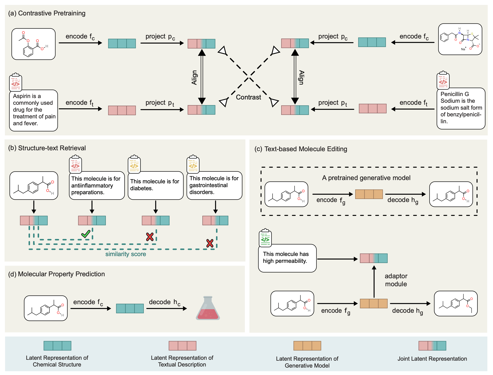

# MoleculeSTM: Multi-modal Molecule Structure-text Model for Text-based Editing and Retrieval

Authors: Shengchao Liu, Weili Nie, Chengpeng Wang, Jiarui Lu, Zhuoran Qiao, Ling Liu, Jian Tang<sup>\*</sup>, Chaowei Xiao<sup>\*</sup>, Anima Anandkumar<sup>\*</sup>

<sup>\*</sup> jointly supervised

[[Paper](https://www.nature.com/articles/s42256-023-00759-6)]
[[Project Page](https://chao1224.github.io/MoleculeSTM)] [[ArXiv](https://arxiv.org/abs/2212.10789)]
[[Datasets on Hugging Face](https://huggingface.co/datasets/chao1224/MoleculeSTM/tree/main)] [[Checkpoints on Hugging Face](https://huggingface.co/chao1224/MoleculeSTM/tree/main)]


<p align="center">
   
</p>

<p align="left">
   
</p>

## 1 Environment

First install conda:
```
wget https://repo.anaconda.com/miniconda/Miniconda3-latest-Linux-x86_64.sh
bash Miniconda3-latest-Linux-x86_64.sh
```

Then create virtual environment and install packages:
```
conda create -n MoleculeSTM python=3.7
conda activate MoleculeSTM

conda install -y -c rdkit rdkit=2020.09.1.0
conda install -y -c conda-forge -c pytorch pytorch=1.9.1
conda install -y -c pyg -c conda-forge pyg==2.0.3

pip install requests
pip install tqdm
pip install matplotlib
pip install spacy
pip install Levenshtein

# for SciBert
conda install -y boto3
pip install transformers

# for MoleculeNet
pip install ogb==1.2.0

# install pysmilesutils
python -m pip install git+https://github.com/MolecularAI/pysmilesutils.git

pip install deepspeed

# install metagron
# pip install megatron-lm==1.1.5
git clone https://github.com/MolecularAI/MolBART.git --branch megatron-molbart-with-zinc
cd MolBART/megatron_molbart/Megatron-LM-v1.1.5-3D_parallelism
pip install .
cd ../../..

# install apex
# wget https://github.com/NVIDIA/apex/archive/refs/tags/22.03.zip
# unzip 22.03.zip
git clone https://github.com/chao1224/apex.git
cd apex
pip install -v --disable-pip-version-check --no-cache-dir --global-option="--cpp_ext" --global-option="--cuda_ext" ./
cd ..
```

We also provide the docker in `Dockerfile`.

## 2 Datasets and Preprocessing

We provide the raw dataset (after preprocessing) at [this Hugging Face link](https://huggingface.co/datasets/chao1224/MoleculeSTM). Or you can use the following python script:
```
from huggingface_hub import HfApi, snapshot_download
api = HfApi()
snapshot_download(repo_id="chao1224/MoleculeSTM", repo_type="dataset", local_dir='.')
```

Then you can move all the downloaded datasets under `./data` folder.

### 2.1 Pretraining Dataset: PubChemSTM

Useful resources:
- For molecular structure information (SMILES, 2D molecular graph etc), we can download it from PubChem in SDF format [here](https://ftp.ncbi.nlm.nih.gov/pubchem/Compound/CURRENT-Full/SDF/).
- For textual data, we may first refer to this [PubChem RDF tutorial](https://ftp.ncbi.nlm.nih.gov/pubchem/presentations/pubchem_rdf_tutorial.pdf).
- `The RDF data on the PubChem FTP site is arranged in such a way that you only need to download the type of information in which you are interested, thus allowing you to avoid downloading parts of PubChem data you will not use. For example, if you are just interested in computed chemical properties, you only need to download PubChemRDF data in the compound descriptor directory.` The link is [here](https://ftp.ncbi.nlm.nih.gov/pubchem/RDF/descriptor/compound/).
- Guidance on using `RDF` and `REST` API can be found [here](https://ftp.ncbi.nlm.nih.gov/pubchem/presentations/pubchem_rdf_details.pdf).

As confirmed with PubChem group, performing research on these data is not violating their license; however, PubChem does not possess the license for the textual data, which necessitates an extensive evaluation of the license for each pair of structure-text pair data in PubChemSTM. This task poses a substantial workload and has hindered the release of PubChemSTM. However, we have tried our best to upload the structure part of the PubChemSTM data on Hugging Face, and we also provide all the details to generate PubChemSTM as follows:
1. Go to `preprocessing/PubChemSTM` folder.
2. `python step_01_description_extraction.py`. This step extracts and merge all the textual descriptions into a single json file. We run this on May 30th, 2022. The APIs will keep updating, so you may have slightly different versions if you run this script yourself.
3. `bash step_02.sh`. This will download all the SDF files, with SMILES, 2D graph, and computed molecular properties. This may take hours.
4. `python step_03_filter_out_SDF.py`. This will filter all the molecules with textual descriptions and save them int the SDF file. This may take <2 hours.
5. `python step_04_merge_SDF.py`. This will gather all the molecules into a single SDF file.
6. `python step_05_sample_extraction.py`. This will generate the `CID2SMILES.csv` file.

### 2.2 Downstream Datasets

We have included them in [the Hugging Face link](https://huggingface.co/datasets/chao1224/MoleculeSTM). We briefly list the details below:

- `DrugBank_data` for zero-shot structure-text retrieval
- `ZINC250K_data` for space alignment (step 1 in editing)
- `Editing_data` for zero-shot text-guided (step 2 in editing)
    - `single_multi_property_SMILES.txt` for single-objective, multi-objective, binding-affinity-based, and drug relevance editing
    - `neighbor2drug` for neighborhood searching for patent drug molecules
    - `ChEMBL_data` for binding editing
- `MoleculeNet_data` for molecular property prediction

## 3 Checkpoints

### 3.1 SciBERT
This can be done by simplying calling the following for SciBERT:
```
SciBERT_tokenizer = AutoTokenizer.from_pretrained('allenai/scibert_scivocab_uncased', cache_dir=pretrained_SciBERT_folder)
SciBERT_model = AutoModel.from_pretrained('allenai/scibert_scivocab_uncased', cache_dir=pretrained_SciBERT_folder).to(device)
```

### 3.2 MegaMolBART
Run `download_MegaMolBART.sh` (credit to [RetMol](https://github.com/NVlabs/RetMol/blob/main/download_scripts/download_models.sh)). The output structure is like:
```
├── bart_vocab.txt
└── checkpoints
    ├── iter_0134000
    │   ├── mp_rank_00
    │   │   └── model_optim_rng.pt
    │   ├── mp_rank_00_model_states.pt
    │   ├── zero_pp_rank_0_mp_rank_00optim_states.pt
    │   ├── zero_pp_rank_1_mp_rank_00optim_states.pt
    │   ├── zero_pp_rank_2_mp_rank_00optim_states.pt
    │   ├── zero_pp_rank_3_mp_rank_00optim_states.pt
    │   ├── zero_pp_rank_4_mp_rank_00optim_states.pt
    │   ├── zero_pp_rank_5_mp_rank_00optim_states.pt
    │   ├── zero_pp_rank_6_mp_rank_00optim_states.pt
    │   └── zero_pp_rank_7_mp_rank_00optim_states.pt
    └── latest_checkpointed_iteration.txt
```

### 3.3 GNN and GraphMVP
For GraphMVP, check this [repo](https://github.com/chao1224/GraphMVP), and the checkpoints on [Google Drive link](https://drive.google.com/drive/u/1/folders/1uPsBiQF3bfeCAXSDd4JfyXiTh-qxYfu6).
```
pretrained_GraphMVP/
├── GraphMVP_C
│   └── model.pth
└── GraphMVP_G
    └── model.pth
```

### 3.4 Baseline KV-PLM
For KV-PLM, check this [repo](https://github.com/thunlp/KV-PLM) and checkpoints on [Google Drive link](https://drive.google.com/drive/folders/1xig3-3JG63kR-Xqj1b9wkPEdxtfD_4IX).

### 3.5 Checkpoints for MoleculeSTM
We provide two sets of demo checkpoints at [this huggingface link](https://huggingface.co/chao1224/MoleculeSTM). Or you can use the following python script:
```
from huggingface_hub import HfApi, snapshot_download
api = HfApi()
snapshot_download(repo_id="chao1224/MoleculeSTM", repo_type="model", cache_dir='.')
```

For the optimal results reported in the paper, please use the following script:
```
from huggingface_hub import HfApi, snapshot_download
api = HfApi()
snapshot_download(repo_id="chao1224/MoleculeSTM", repo_type="model", local_dir='.', allow_patterns="*MoleculeSTM*")
```

We further provide the optimal checkpoints for each downstream task under the `scripts` folder (README file).

## 4 Scripts and Demos

All the running scripts and demos can be found under the `scripts` folder and `demos` folder, respectively.

### 4.1 Pretraining

MoleculeSTM-SMILES
```
python pretrain.py \
    --verbose --batch_size=8 \
    --molecule_type=SMILES
```

MoleculeSTM-Graph
```
python pretrain.py \
    --verbose --batch_size=8 \
    --molecule_type=Graph
```

### 4.2 Downstream: Zero-shot Structure-text Retrieval

**For DrugBank-Description**

MoleculeSTM-SMILES
```
python downstream_01_retrieval_Description_Pharmacodynamics.py \
    --task=molecule_description_removed_PubChem \
    --molecule_type=SMILES \
    --input_model_dir=../data/demo/demo_checkpoints_SMILES
```

MoleculeSTM-Graph
```
python downstream_01_retrieval_Description_Pharmacodynamics.py \
    --task=molecule_description_removed_PubChem \
    --molecule_type=Graph \
    --input_model_dir=../data/demo/demo_checkpoints_Graph
```

**For DrugBank-Pharmacodynamics**

MoleculeSTM-SMILES
```
python downstream_01_retrieval_Description_Pharmacodynamics.py \
    --task=molecule_pharmacodynamics_removed_PubChem \
    --molecule_type=SMILES \
    --input_model_dir=../data/demo/demo_checkpoints_SMILES
```

MoleculeSTM-Graph
```
python downstream_01_retrieval_Description_Pharmacodynamics.py \
    --task=molecule_pharmacodynamics_removed_PubChem \
    --molecule_type=Graph \
    --input_model_dir=../data/demo/demo_checkpoints_Graph
```

**For DrugBank-ATC**


MoleculeSTM-SMILES
```
python downstream_01_retrieval_ATC.py \
    --molecule_type=SMILES \
    --input_model_dir=../data/demo/demo_checkpoints_SMILES
```

MoleculeSTM-Graph
```
python downstream_01_retrieval_ATC.py \
    --molecule_type=Graph \
    --input_model_dir=../data/demo/demo_checkpoints_Graph
```

### 4.3 Downstream: Zero-shot Text-based Molecule Editing

For description id list, you can find them in `MoleculeSTM/downstream_molecule_edit_utils.py`.

MoleculeSTM-SMILES
```
python downstream_02_molecule_edit_step_01_MoleculeSTM_Space_Alignment.py \
    --MoleculeSTM_molecule_type=SMILES \
    --MoleculeSTM_model_dir=../data/demo/demo_checkpoints_SMILES


python downstream_02_molecule_edit_step_02_MoleculeSTM_Latent_Optimization.py \
    --MoleculeSTM_molecule_type=SMILES \
    --MoleculeSTM_model_dir=../data/demo/demo_checkpoints_SMILES \
    --language_edit_model_dir=../data/demo/demo_checkpoints_SMILES \
    --input_description_id=101
```

MoleculeSTM-Graph
```
python downstream_02_molecule_edit_step_01_MoleculeSTM_Space_Alignment.py \
    --MoleculeSTM_molecule_type=Graph \
    --MoleculeSTM_model_dir=../data/demo/demo_checkpoints_Graph


python downstream_02_molecule_edit_step_02_MoleculeSTM_Latent_Optimization.py \
    --MoleculeSTM_molecule_type=Graph \
    --MoleculeSTM_model_dir=../data/demo/demo_checkpoints_Graph \
    --language_edit_model_dir=../data/demo/demo_checkpoints_Graph \
    --input_description_id=101
```

### 4.4 Downstream: Molecular Property Prediction

MoleculeSTM-SMILES
```
python downstream_03_property_prediction.py \
    --dataset=bace --molecule_type=SMILES \
```

MoleculeSTM-Graph
```
python downstream_03_property_prediction.py \
    --dataset=bace --molecule_type=Graph
```

### 4.5 Demo
Please check the `demos` folder. This may require you download the dataset and checkpoints first:
- raw dataset (after preprocessing) at [this huggingface link](https://huggingface.co/datasets/chao1224/MoleculeSTM).
- checkpoints at [this huggingface link](https://huggingface.co/chao1224/MoleculeSTM).

## Cite Us
Feel free to cite this work if you find it useful to you!
```
@article{liu2023moleculestm,
    title={Multi-modal molecule structure-text model for text-based retrieval and editing},
    author={Liu, Shengchao and Nie, Weili and Wang, Chengpeng and Lu, Jiarui and Qiao, Zhuoran and Liu, Ling and Tang, Jian and Xiao, Chaowei and Anandkumar, Anima},
    title={Multi-modal molecule structure--text model for text-based retrieval and editing},
    journal={Nature Machine Intelligence},
    year={2023},
    month={Dec},
    day={01},
    volume={5},
    number={12},
    pages={1447-1457},
    issn={2522-5839},
    doi={10.1038/s42256-023-00759-6},
    url={https://doi.org/10.1038/s42256-023-00759-6}
}
```